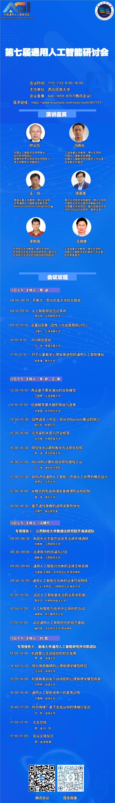

# 第七届中国通用人工智能年会

**时间地点**：2022年7月12-13日，西北民族大学

## 会议视频

| 场次 | B站链接 |
|------|---------|
| 主旨报告 | [BV1fS4y177JZ](https://www.bilibili.com/video/BV1fS4y177JZ) |
| 专题报告 | [BV1bB4y1Y7Fu](https://www.bilibili.com/video/BV1bB4y1Y7Fu) |
| 专项报告Ⅰ · 法律团队 | [BV1xY4y1j7pA](https://www.bilibili.com/video/BV1xY4y1j7pA) |
| 专项报告Ⅱ · 刘凯团队 | [BV16G411n7F4](https://www.bilibili.com/video/BV16G411n7F4) |

## 会议内容

| # | 来源 | 报告人 | 报告标题 |
|---|------|--------|---------|
| 1 | [B站](https://www.bilibili.com/video/BV1fS4y177JZ?p=2) | 钟义信 | 人工智能研究范式革命 |
| 2 | [B站](https://www.bilibili.com/video/BV1fS4y177JZ?p=3) | 冯嘉礼 | 定量×定象⇒定性（大成智慧研讨厅） |
| 3 | [B站](https://www.bilibili.com/video/BV1fS4y177JZ?p=4) | 王培 | AGI研究现状 |
| 4 | [B站](https://www.bilibili.com/video/BV1fS4y177JZ?p=5) | 徐英瑾 | 对于儿童数学心理发展进程的通用人工智能模拟 |
| 5 | [B站](https://www.bilibili.com/video/BV1bB4y1Y7Fu?p=1) | 王晓峰 | 再谈基于需求演化的自我模型 |
| 6 | [B站](https://www.bilibili.com/video/BV1bB4y1Y7Fu?p=2) | 余新国 | 机器解答算术题的挑战与进展 |
| 7 | [B站](https://www.bilibili.com/video/BV1bB4y1Y7Fu?p=3) | 陈礼军 | 自然语言（中文）转化为Narsese算法的探讨 |
| 8 | [B站](https://www.bilibili.com/video/BV1bB4y1Y7Fu?p=4) | 朱宗晓 | 元宇宙的本质与产业框架 |
| 9 | [B站](https://www.bilibili.com/video/BV1bB4y1Y7Fu?p=5) | 那迪 | 研究生AGI课程教学方法研究初探 |
| 10 | [B站](https://www.bilibili.com/video/BV1bB4y1Y7Fu?p=6) | 王涛 | BIGAI的计算机视觉研究路线之议 |
| 11 | [B站](https://www.bilibili.com/video/BV1bB4y1Y7Fu?p=7) | 徐博文 | 如何评估通用人工智能：开放人工世界的概念设计 |
| 12 | [B站](https://www.bilibili.com/video/BV1bB4y1Y7Fu?p=8) | 黄彧 | 从概念的形成和演变看推理的认知机制 |
| 13 | [B站](https://www.bilibili.com/video/BV1bB4y1Y7Fu?p=9) | 冯博杰 | 基于遗传策略的语用关联性优化 |
| 14 | [B站](https://www.bilibili.com/video/BV1xY4y1j7pA?p=1) | 刘彬彬 | 南昌市元宇宙产业及其法律环境调研 |
| 15 | [B站](https://www.bilibili.com/video/BV1xY4y1j7pA?p=2) | 陶思琦 | 法律奇点的内涵与讨论 |
| 16 | [B站](https://www.bilibili.com/video/BV1xY4y1j7pA?p=3) | 沈建铭 | 通用人工智能行为体的法律主体资格 |
| 17 | [B站](https://www.bilibili.com/video/BV1xY4y1j7pA?p=4) | 韦邦龙 | 通用人工智能行为体的法律可规制性 |
| 18 | [B站](https://www.bilibili.com/video/BV1xY4y1j7pA?p=5) | 易学文 | 试论人工智能基本法的法哲学前提 |
| 19 | [B站](https://www.bilibili.com/video/BV1xY4y1j7pA?p=6) | 谢霖枫 | 人工和智能与技术中立原则的互动 |
| 20 | [B站](https://www.bilibili.com/video/BV1xY4y1j7pA?p=7) | 碗昀皓 | 试论通用人工智能时代的规范基础 |
| 21 | [B站](https://www.bilibili.com/video/BV16G411n7F4?p=2) | 贾敏、刘凯 | 机器婴儿主动视觉的初步发展 |
| 22 | [B站](https://www.bilibili.com/video/BV16G411n7F4?p=3) | 汪诗雨、刘凯 | 双向情感障碍的心理病理学模型研究 |
| 23 | [B站](https://www.bilibili.com/video/BV16G411n7F4?p=4) | 卢桥桥、刘凯 | 机器教育启发下自闭症的心理病理学模型探新 |
| 24 | [B站](https://www.bilibili.com/video/BV16G411n7F4?p=5) | 王傲楠、刘凯 | 通用人工智能视角下的新常识观 |
| 25 | [B站](https://www.bilibili.com/video/BV16G411n7F4?p=6) | 刘凯 | 何为情绪？基于生成认知的情绪衍生论 |

## 年会海报

