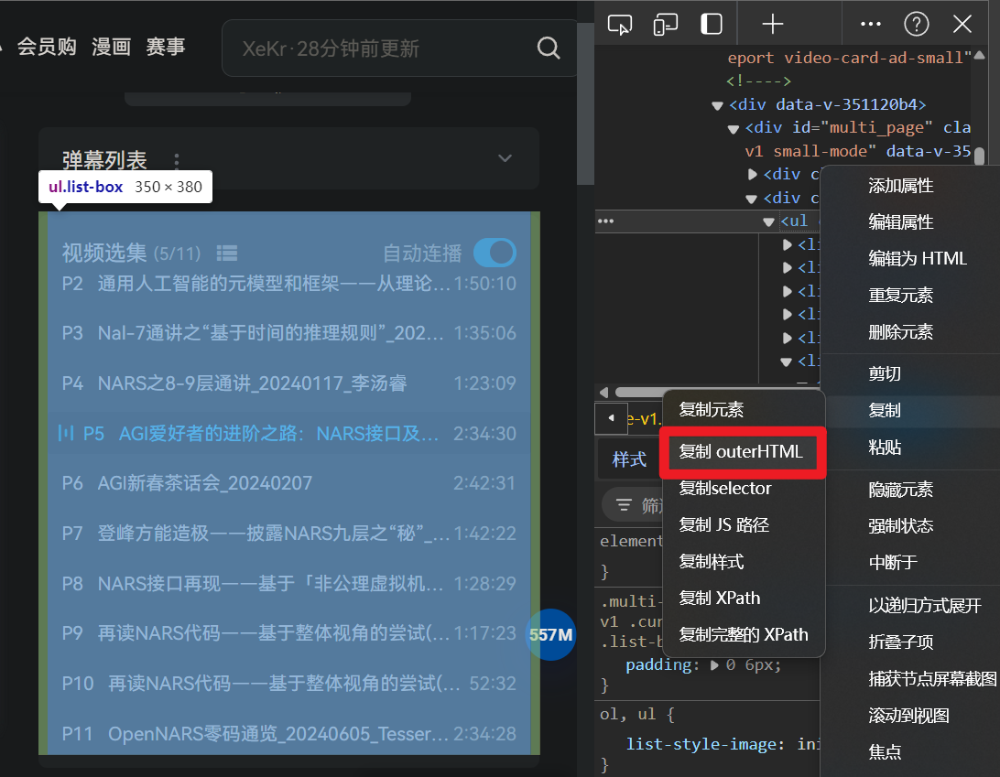

# 搬运指南

## 搬运内容格式与方法

1. 各章节总索引使用 `index.md`，可在最终网页中变为 `index.html` 并节省链接长度
2. 推荐使用 <https://www.helloworld.net/html2md> 将HTML转换成Markdown，避免手动搬迁粗体斜体等细节
3. 内部链接使用相对路径，如 `../`
    1. 文档内部原先链接到内部HTML的，若有搬运，最好全部内联到Markdown，以完整搬运其链接关系
4. 一些页头页脚等元素，若有内容完整性需要，可在合并后舍去

## 组会目录更新

此处提供一种**从B站更新年会组会目录**的方法。

### 适用环境

已验证起效的操作环境：

- 电脑，Windows 10+
- 浏览器：Chrome、EDGE
- 文本编辑器：VSCode

### 操作方法

1. 【打开页面】打开相应视频合集页面，如 <https://www.bilibili.com/video/BV1o94y1r7hB/>

2. 【检查元素】对「视频选集」处右键，打开「检查/审查元素」：


3. 【复制HTML】注意到右侧开发者工具中的`<ul class="list-box" ...>`，右击并复制其HTML内容：


4. 【整理文本】在文本编辑器中利用各种方式（如 多光标处理）整理规范化的多级列表HTML，整理过程参见[参考outerHTML整理过程](#outerhtml)

#### 参考outerHTML整理过程

🕒内容最后更新日期：2024-08-18

【0】直接复制元素后的原始HTML文本：

```html
<ul class="list-box"><li class=""><a href="/video/BV1o94y1r7hB?p=1" class="router-link-active" title="何以停机——论以数据“市场”为外部制约条件的停机机制对AGI的意义_20230809_马翰林"><div class="clickitem"><div class="link-content"> <span class="page-num">P1</span> <span class="part">何以停机——论以数据“市场”为外部制约条件的停机机制对AGI的意义_20230809_马翰林</span></div> <div class="duration">1:59:39</div></div></a></li><li class=""><a href="/video/BV1o94y1r7hB?p=2" class="router-link-active" title="通用人工智能的元模型和框架——从理论到实践_20231122_那迪"><div class="clickitem"><div class="link-content"> <span class="page-num">P2</span> <span class="part">通用人工智能的元模型和框架——从理论到实践_20231122_那迪</span></div> <div class="duration">1:50:10</div></div></a></li><li class=""><a href="/video/BV1o94y1r7hB?p=3" class="router-link-active" title="Nal-7通讲之“基于时间的推理规则”_20240103_李汤睿"><div class="clickitem"><div class="link-content"> <span class="page-num">P3</span> <span class="part">Nal-7通讲之“基于时间的推理规则”_20240103_李汤睿</span></div> <div class="duration">1:35:06</div></div></a></li><li class=""><a href="/video/BV1o94y1r7hB?p=4" class="router-link-active" title="NARS之8-9层通讲_20240117_李汤睿"><div class="clickitem"><div class="link-content"> <span class="page-num">P4</span> <span class="part">NARS之8-9层通讲_20240117_李汤睿</span></div> <div class="duration">1:23:09</div></div></a></li><li class="watched on"><a href="/video/BV1o94y1r7hB?p=5" class="router-link-active" title="AGI爱好者的进阶之路：NARS接口及衍生实验_20240124_Tessergon"><div class="clickitem"><div class="link-content"> <span class="page-num">P5</span> <span class="part">AGI爱好者的进阶之路：NARS接口及衍生实验_20240124_Tessergon</span></div> <div class="duration">2:34:30</div></div></a></li><li class=""><a href="/video/BV1o94y1r7hB?p=6" class="router-link-active" title="AGI新春茶话会_20240207"><div class="clickitem"><div class="link-content"> <span class="page-num">P6</span> <span class="part">AGI新春茶话会_20240207</span></div> <div class="duration">2:42:31</div></div></a></li><li class=""><a href="/video/BV1o94y1r7hB?p=7" class="router-link-active" title="登峰方能造极——披露NARS九层之“秘”_20240228_李汤睿"><div class="clickitem"><div class="link-content"> <span class="page-num">P7</span> <span class="part">登峰方能造极——披露NARS九层之“秘”_20240228_李汤睿</span></div> <div class="duration">1:42:22</div></div></a></li><li class=""><a href="/video/BV1o94y1r7hB?p=8" class="router-link-active" title="NARS接口再现——基于「非公理虚拟机」的统一IO模型_20240403_Tessergon"><div class="clickitem"><div class="link-content"> <span class="page-num">P8</span> <span class="part">NARS接口再现——基于「非公理虚拟机」的统一IO模型_20240403_Tessergon</span></div> <div class="duration">1:28:29</div></div></a></li><li class=""><a href="/video/BV1o94y1r7hB?p=9" class="router-link-active" title="再读NARS代码——基于整体视角的尝试(一)_20240410_张涛"><div class="clickitem"><div class="link-content"> <span class="page-num">P9</span> <span class="part">再读NARS代码——基于整体视角的尝试(一)_20240410_张涛</span></div> <div class="duration">1:17:23</div></div></a></li><li class=""><a href="/video/BV1o94y1r7hB?p=10" class="router-link-active" title="再读NARS代码——基于整体视角的尝试(二)_20240522_张涛"><div class="clickitem"><div class="link-content"> <span class="page-num">P10</span> <span class="part">再读NARS代码——基于整体视角的尝试(二)_20240522_张涛</span></div> <div class="duration">52:32</div></div></a></li><li class=""><a href="/video/BV1o94y1r7hB?p=11" class="router-link-active" title="OpenNARS零码通览_20240605_Tessergon"><div class="clickitem"><div class="link-content"> <span class="page-num">P11</span> <span class="part">OpenNARS零码通览_20240605_Tessergon</span></div> <div class="duration">2:34:28</div></div></a></li></ul>
```

【1】在每个`<a href="/`的开头换行：

```html
<ul class="list-box"><li class="">
<a href="/video/BV1o94y1r7hB?p=1" class="router-link-active" title="何以停机——论以数据“市场”为外部制约条件的停机机制对AGI的意义_20230809_马翰林"><div class="clickitem"><div class="link-content"> <span class="page-num">P1</span> <span class="part">何以停机——论以数据“市场”为外部制约条件的停机机制对AGI的意义_20230809_马翰林</span></div> <div class="duration">1:59:39</div></div></a></li><li class="">
<a href="/video/BV1o94y1r7hB?p=2" class="router-link-active" title="通用人工智能的元模型和框架——从理论到实践_20231122_那迪"><div class="clickitem"><div class="link-content"> <span class="page-num">P2</span> <span class="part">通用人工智能的元模型和框架——从理论到实践_20231122_那迪</span></div> <div class="duration">1:50:10</div></div></a></li><li class="">
<a href="/video/BV1o94y1r7hB?p=3" class="router-link-active" title="Nal-7通讲之“基于时间的推理规则”_20240103_李汤睿"><div class="clickitem"><div class="link-content"> <span class="page-num">P3</span> <span class="part">Nal-7通讲之“基于时间的推理规则”_20240103_李汤睿</span></div> <div class="duration">1:35:06</div></div></a></li><li class="">
<a href="/video/BV1o94y1r7hB?p=4" class="router-link-active" title="NARS之8-9层通讲_20240117_李汤睿"><div class="clickitem"><div class="link-content"> <span class="page-num">P4</span> <span class="part">NARS之8-9层通讲_20240117_李汤睿</span></div> <div class="duration">1:23:09</div></div></a></li><li class="watched on">
<a href="/video/BV1o94y1r7hB?p=5" class="router-link-active" title="AGI爱好者的进阶之路：NARS接口及衍生实验_20240124_Tessergon"><div class="clickitem"><div class="link-content"> <span class="page-num">P5</span> <span class="part">AGI爱好者的进阶之路：NARS接口及衍生实验_20240124_Tessergon</span></div> <div class="duration">2:34:30</div></div></a></li><li class="">
<a href="/video/BV1o94y1r7hB?p=6" class="router-link-active" title="AGI新春茶话会_20240207"><div class="clickitem"><div class="link-content"> <span class="page-num">P6</span> <span class="part">AGI新春茶话会_20240207</span></div> <div class="duration">2:42:31</div></div></a></li><li class="">
<a href="/video/BV1o94y1r7hB?p=7" class="router-link-active" title="登峰方能造极——披露NARS九层之“秘”_20240228_李汤睿"><div class="clickitem"><div class="link-content"> <span class="page-num">P7</span> <span class="part">登峰方能造极——披露NARS九层之“秘”_20240228_李汤睿</span></div> <div class="duration">1:42:22</div></div></a></li><li class="">
<a href="/video/BV1o94y1r7hB?p=8" class="router-link-active" title="NARS接口再现——基于「非公理虚拟机」的统一IO模型_20240403_Tessergon"><div class="clickitem"><div class="link-content"> <span class="page-num">P8</span> <span class="part">NARS接口再现——基于「非公理虚拟机」的统一IO模型_20240403_Tessergon</span></div> <div class="duration">1:28:29</div></div></a></li><li class="">
<a href="/video/BV1o94y1r7hB?p=9" class="router-link-active" title="再读NARS代码——基于整体视角的尝试(一)_20240410_张涛"><div class="clickitem"><div class="link-content"> <span class="page-num">P9</span> <span class="part">再读NARS代码——基于整体视角的尝试(一)_20240410_张涛</span></div> <div class="duration">1:17:23</div></div></a></li><li class="">
<a href="/video/BV1o94y1r7hB?p=10" class="router-link-active" title="再读NARS代码——基于整体视角的尝试(二)_20240522_张涛"><div class="clickitem"><div class="link-content"> <span class="page-num">P10</span> <span class="part">再读NARS代码——基于整体视角的尝试(二)_20240522_张涛</span></div> <div class="duration">52:32</div></div></a></li><li class="">
<a href="/video/BV1o94y1r7hB?p=11" class="router-link-active" title="OpenNARS零码通览_20240605_Tessergon"><div class="clickitem"><div class="link-content"> <span class="page-num">P11</span> <span class="part">OpenNARS零码通览_20240605_Tessergon</span></div> <div class="duration">2:34:28</div></div></a></li></ul>
```

【2】删去首行的`<ul class="list-box"><li class="">`与每行`<div class="clickitem">`之后的内容：

```html
<a href="/video/BV1o94y1r7hB?p=1" class="router-link-active" title="何以停机——论以数据“市场”为外部制约条件的停机机制对AGI的意义_20230809_马翰林">
<a href="/video/BV1o94y1r7hB?p=2" class="router-link-active" title="通用人工智能的元模型和框架——从理论到实践_20231122_那迪">
<a href="/video/BV1o94y1r7hB?p=3" class="router-link-active" title="Nal-7通讲之“基于时间的推理规则”_20240103_李汤睿">
<a href="/video/BV1o94y1r7hB?p=4" class="router-link-active" title="NARS之8-9层通讲_20240117_李汤睿">
<a href="/video/BV1o94y1r7hB?p=5" class="router-link-active" title="AGI爱好者的进阶之路：NARS接口及衍生实验_20240124_Tessergon">
<a href="/video/BV1o94y1r7hB?p=6" class="router-link-active" title="AGI新春茶话会_20240207">
<a href="/video/BV1o94y1r7hB?p=7" class="router-link-active" title="登峰方能造极——披露NARS九层之“秘”_20240228_李汤睿">
<a href="/video/BV1o94y1r7hB?p=8" class="router-link-active" title="NARS接口再现——基于「非公理虚拟机」的统一IO模型_20240403_Tessergon">
<a href="/video/BV1o94y1r7hB?p=9" class="router-link-active" title="再读NARS代码——基于整体视角的尝试(一)_20240410_张涛">
<a href="/video/BV1o94y1r7hB?p=10" class="router-link-active" title="再读NARS代码——基于整体视角的尝试(二)_20240522_张涛">
<a href="/video/BV1o94y1r7hB?p=11" class="router-link-active" title="OpenNARS零码通览_20240605_Tessergon">
```

【3】将每行行首的`<a href="`替换为B站合集页面链接 <https://www.bilibili.com/video/BV1o94y1r7hB/> 的前缀 `https://www.bilibili.com`：

```plaintext
https://www.bilibili.com/video/BV1o94y1r7hB?p=1" class="router-link-active" title="何以停机——论以数据“市场”为外部制约条件的停机机制对AGI的意义_20230809_马翰林">
https://www.bilibili.com/video/BV1o94y1r7hB?p=2" class="router-link-active" title="通用人工智能的元模型和框架——从理论到实践_20231122_那迪">
https://www.bilibili.com/video/BV1o94y1r7hB?p=3" class="router-link-active" title="Nal-7通讲之“基于时间的推理规则”_20240103_李汤睿">
https://www.bilibili.com/video/BV1o94y1r7hB?p=4" class="router-link-active" title="NARS之8-9层通讲_20240117_李汤睿">
https://www.bilibili.com/video/BV1o94y1r7hB?p=5" class="router-link-active" title="AGI爱好者的进阶之路：NARS接口及衍生实验_20240124_Tessergon">
https://www.bilibili.com/video/BV1o94y1r7hB?p=6" class="router-link-active" title="AGI新春茶话会_20240207">
https://www.bilibili.com/video/BV1o94y1r7hB?p=7" class="router-link-active" title="登峰方能造极——披露NARS九层之“秘”_20240228_李汤睿">
https://www.bilibili.com/video/BV1o94y1r7hB?p=8" class="router-link-active" title="NARS接口再现——基于「非公理虚拟机」的统一IO模型_20240403_Tessergon">
https://www.bilibili.com/video/BV1o94y1r7hB?p=9" class="router-link-active" title="再读NARS代码——基于整体视角的尝试(一)_20240410_张涛">
https://www.bilibili.com/video/BV1o94y1r7hB?p=10" class="router-link-active" title="再读NARS代码——基于整体视角的尝试(二)_20240522_张涛">
https://www.bilibili.com/video/BV1o94y1r7hB?p=11" class="router-link-active" title="OpenNARS零码通览_20240605_Tessergon">
```

【4】将每行「`title="`之后、行尾`">`之前的内容」用`[]`包裹，并前置在行首：

```plaintext
[何以停机——论以数据“市场”为外部制约条件的停机机制对AGI的意义_20230809_马翰林]https://www.bilibili.com/video/BV1o94y1r7hB?p=1" class="router-link-active" title="">
[通用人工智能的元模型和框架——从理论到实践_20231122_那迪]https://www.bilibili.com/video/BV1o94y1r7hB?p=2" class="router-link-active" title="">
[Nal-7通讲之“基于时间的推理规则”_20240103_李汤睿]https://www.bilibili.com/video/BV1o94y1r7hB?p=3" class="router-link-active" title="">
[NARS之8-9层通讲_20240117_李汤睿]https://www.bilibili.com/video/BV1o94y1r7hB?p=4" class="router-link-active" title="">
[AGI爱好者的进阶之路：NARS接口及衍生实验_20240124_Tessergon]https://www.bilibili.com/video/BV1o94y1r7hB?p=5" class="router-link-active" title="">
[AGI新春茶话会_20240207]https://www.bilibili.com/video/BV1o94y1r7hB?p=6" class="router-link-active" title="">
[登峰方能造极——披露NARS九层之“秘”_20240228_李汤睿]https://www.bilibili.com/video/BV1o94y1r7hB?p=7" class="router-link-active" title="">
[NARS接口再现——基于「非公理虚拟机」的统一IO模型_20240403_Tessergon]https://www.bilibili.com/video/BV1o94y1r7hB?p=8" class="router-link-active" title="">
[再读NARS代码——基于整体视角的尝试(一)_20240410_张涛]https://www.bilibili.com/video/BV1o94y1r7hB?p=9" class="router-link-active" title="">
[再读NARS代码——基于整体视角的尝试(二)_20240522_张涛]https://www.bilibili.com/video/BV1o94y1r7hB?p=10" class="router-link-active" title="">
[OpenNARS零码通览_20240605_Tessergon]https://www.bilibili.com/video/BV1o94y1r7hB?p=11" class="router-link-active" title="">
```

【5】去掉每行行尾的`" class="router-link-active" title="">`：

```plaintext
[何以停机——论以数据“市场”为外部制约条件的停机机制对AGI的意义_20230809_马翰林]https://www.bilibili.com/video/BV1o94y1r7hB?p=1
[通用人工智能的元模型和框架——从理论到实践_20231122_那迪]https://www.bilibili.com/video/BV1o94y1r7hB?p=2
[Nal-7通讲之“基于时间的推理规则”_20240103_李汤睿]https://www.bilibili.com/video/BV1o94y1r7hB?p=3
[NARS之8-9层通讲_20240117_李汤睿]https://www.bilibili.com/video/BV1o94y1r7hB?p=4
[AGI爱好者的进阶之路：NARS接口及衍生实验_20240124_Tessergon]https://www.bilibili.com/video/BV1o94y1r7hB?p=5
[AGI新春茶话会_20240207]https://www.bilibili.com/video/BV1o94y1r7hB?p=6
[登峰方能造极——披露NARS九层之“秘”_20240228_李汤睿]https://www.bilibili.com/video/BV1o94y1r7hB?p=7
[NARS接口再现——基于「非公理虚拟机」的统一IO模型_20240403_Tessergon]https://www.bilibili.com/video/BV1o94y1r7hB?p=8
[再读NARS代码——基于整体视角的尝试(一)_20240410_张涛]https://www.bilibili.com/video/BV1o94y1r7hB?p=9
[再读NARS代码——基于整体视角的尝试(二)_20240522_张涛]https://www.bilibili.com/video/BV1o94y1r7hB?p=10
[OpenNARS零码通览_20240605_Tessergon]https://www.bilibili.com/video/BV1o94y1r7hB?p=11
```

【6】将每个链接以`()`包裹（`https://www.bilibili.com/`前输入`(`，行尾输入`)`）：

```markdown
[何以停机——论以数据“市场”为外部制约条件的停机机制对AGI的意义_20230809_马翰林](https://www.bilibili.com/video/BV1o94y1r7hB?p=1)
[通用人工智能的元模型和框架——从理论到实践_20231122_那迪](https://www.bilibili.com/video/BV1o94y1r7hB?p=2)
[Nal-7通讲之“基于时间的推理规则”_20240103_李汤睿](https://www.bilibili.com/video/BV1o94y1r7hB?p=3)
[NARS之8-9层通讲_20240117_李汤睿](https://www.bilibili.com/video/BV1o94y1r7hB?p=4)
[AGI爱好者的进阶之路：NARS接口及衍生实验_20240124_Tessergon](https://www.bilibili.com/video/BV1o94y1r7hB?p=5)
[AGI新春茶话会_20240207](https://www.bilibili.com/video/BV1o94y1r7hB?p=6)
[登峰方能造极——披露NARS九层之“秘”_20240228_李汤睿](https://www.bilibili.com/video/BV1o94y1r7hB?p=7)
[NARS接口再现——基于「非公理虚拟机」的统一IO模型_20240403_Tessergon](https://www.bilibili.com/video/BV1o94y1r7hB?p=8)
[再读NARS代码——基于整体视角的尝试(一)_20240410_张涛](https://www.bilibili.com/video/BV1o94y1r7hB?p=9)
[再读NARS代码——基于整体视角的尝试(二)_20240522_张涛](https://www.bilibili.com/video/BV1o94y1r7hB?p=10)
[OpenNARS零码通览_20240605_Tessergon](https://www.bilibili.com/video/BV1o94y1r7hB?p=11)
```

【7】在行首附加Markdown无序列表符号`-`/`*`，便得到最终Markdown源码：

```markdown
- [何以停机——论以数据“市场”为外部制约条件的停机机制对AGI的意义_20230809_马翰林](https://www.bilibili.com/video/BV1o94y1r7hB?p=1)
- [通用人工智能的元模型和框架——从理论到实践_20231122_那迪](https://www.bilibili.com/video/BV1o94y1r7hB?p=2)
- [Nal-7通讲之“基于时间的推理规则”_20240103_李汤睿](https://www.bilibili.com/video/BV1o94y1r7hB?p=3)
- [NARS之8-9层通讲_20240117_李汤睿](https://www.bilibili.com/video/BV1o94y1r7hB?p=4)
- [AGI爱好者的进阶之路：NARS接口及衍生实验_20240124_Tessergon](https://www.bilibili.com/video/BV1o94y1r7hB?p=5)
- [AGI新春茶话会_20240207](https://www.bilibili.com/video/BV1o94y1r7hB?p=6)
- [登峰方能造极——披露NARS九层之“秘”_20240228_李汤睿](https://www.bilibili.com/video/BV1o94y1r7hB?p=7)
- [NARS接口再现——基于「非公理虚拟机」的统一IO模型_20240403_Tessergon](https://www.bilibili.com/video/BV1o94y1r7hB?p=8)
- [再读NARS代码——基于整体视角的尝试(一)_20240410_张涛](https://www.bilibili.com/video/BV1o94y1r7hB?p=9)
- [再读NARS代码——基于整体视角的尝试(二)_20240522_张涛](https://www.bilibili.com/video/BV1o94y1r7hB?p=10)
- [OpenNARS零码通览_20240605_Tessergon](https://www.bilibili.com/video/BV1o94y1r7hB?p=11)
```

/// info | 最终Markdown效果

- [何以停机——论以数据“市场”为外部制约条件的停机机制对AGI的意义_20230809_马翰林](https://www.bilibili.com/video/BV1o94y1r7hB?p=1)
- [通用人工智能的元模型和框架——从理论到实践_20231122_那迪](https://www.bilibili.com/video/BV1o94y1r7hB?p=2)
- [Nal-7通讲之“基于时间的推理规则”_20240103_李汤睿](https://www.bilibili.com/video/BV1o94y1r7hB?p=3)
- [NARS之8-9层通讲_20240117_李汤睿](https://www.bilibili.com/video/BV1o94y1r7hB?p=4)
- [AGI爱好者的进阶之路：NARS接口及衍生实验_20240124_Tessergon](https://www.bilibili.com/video/BV1o94y1r7hB?p=5)
- [AGI新春茶话会_20240207](https://www.bilibili.com/video/BV1o94y1r7hB?p=6)
- [登峰方能造极——披露NARS九层之“秘”_20240228_李汤睿](https://www.bilibili.com/video/BV1o94y1r7hB?p=7)
- [NARS接口再现——基于「非公理虚拟机」的统一IO模型_20240403_Tessergon](https://www.bilibili.com/video/BV1o94y1r7hB?p=8)
- [再读NARS代码——基于整体视角的尝试(一)_20240410_张涛](https://www.bilibili.com/video/BV1o94y1r7hB?p=9)
- [再读NARS代码——基于整体视角的尝试(二)_20240522_张涛](https://www.bilibili.com/video/BV1o94y1r7hB?p=10)
- [OpenNARS零码通览_20240605_Tessergon](https://www.bilibili.com/video/BV1o94y1r7hB?p=11)

///

#### 参考自动处理代码

此处以[Julia](https://julialang.org/)代码演示之：

```julia
# Julia正则替换 代码参考：https://stackoverflow.com/questions/49276960/replace-with-captured-group-in-julia
# 这里的文本可以换成其它从 `<ul class="list-box">` 整来的HTML

function HTML处理(s::String)::String
    # 0
    s = s |> strip

    # 1
    s = replace(
        s,
        """<a href="/""" => (x -> "\n$x"),
    )

    # 2
    s = replace(
        s,
        """<ul class="list-box"><li class="watched on">""" => "",
        r"""<div class="clickitem">[^\n]*""" => "",
    )

    # 3
    s = replace(
        s,
        "<a href=\"" => "https://www.bilibili.com",
    )

    # 4
    s = replace(
        s,
        r"""(.*title=")(.*)\">""" => s"[\2]\1\">",
    )

    # 5
    s = replace(
        s,
        r"""" class="(?:.*)" title="">""" => "",
    )

    # 6
    s = replace(
        s,
        r"(https://www.bilibili.com/.*)" => s"(\1)",
    )

    # 7
    s = replace(
        s,
        r"([^\n].*)" => s"- \1",
    )

    # 最终效果
    s |> strip
end

# 示例
s = """
<ul class="list-box"><li class="watched on"><a href="/video/BV1zE421A7rr?p=1" class="" title="01_周倩如_形式化可解释人工智能进展"><div class="clickitem"><div class="link-content"> <span class="page-num">P1</span> <span class="part">01_周倩如_形式化可解释人工智能进展</span></div> <div class="duration">31:40</div></div></a></li><li class=""><a href="/video/BV1zE421A7rr?p=2" class="" title="02_张姗姗_视觉行人搜索领域研究进展"><div class="clickitem"><div class="link-content"> <span class="page-num">P2</span> <span class="part">02_张姗姗_视觉行人搜索领域研究进展</span></div> <div class="duration">38:19</div></div></a></li><li class=""><a href="/video/BV1zE421A7rr?p=3" class="" title="03_那迪_以知识生态学为基础的信念演化模型"><div class="clickitem"><div class="link-content"> <span class="page-num">P3</span> <span class="part">03_那迪_以知识生态学为基础的信念演化模型</span></div> <div class="duration">25:49</div></div></a></li><li class=""><a href="/video/BV1zE421A7rr?p=4" class="" title="04_杨明鑫_基于非公理化逻辑的城市消防案例推理方法研究"><div class="clickitem"><div class="link-content"> <span class="page-num">P4</span> <span class="part">04_杨明鑫_基于非公理化逻辑的城市消防案例推理方法研究</span></div> <div class="duration">18:01</div></div></a></li><li class=""><a href="/video/BV1zE421A7rr?p=5" class="" title="05_周芃_重新思考通用人工智能：类脑计算与智能涌现"><div class="clickitem"><div class="link-content"> <span class="page-num">P5</span> <span class="part">05_周芃_重新思考通用人工智能：类脑计算与智能涌现</span></div> <div class="duration">29:41</div></div></a></li></ul>
""" |> HTML处理

print(s) # 打印
using InteractiveUtils
clipboard(s) # 复制到剪贴板
```

预期结果：

```markdown
- [01_周倩如_形式化可解释人工智能进展](https://www.bilibili.com/video/BV1zE421A7rr?p=1)
- [02_张姗姗_视觉行人搜索领域研究进展](https://www.bilibili.com/video/BV1zE421A7rr?p=2)
- [03_那迪_以知识生态学为基础的信念演化模型](https://www.bilibili.com/video/BV1zE421A7rr?p=3)
- [04_杨明鑫_基于非公理化逻辑的城市消防案例推理方法研究](https://www.bilibili.com/video/BV1zE421A7rr?p=4)
- [05_周芃_重新思考通用人工智能：类脑计算与智能涌现](https://www.bilibili.com/video/BV1zE421A7rr?p=5)
```
