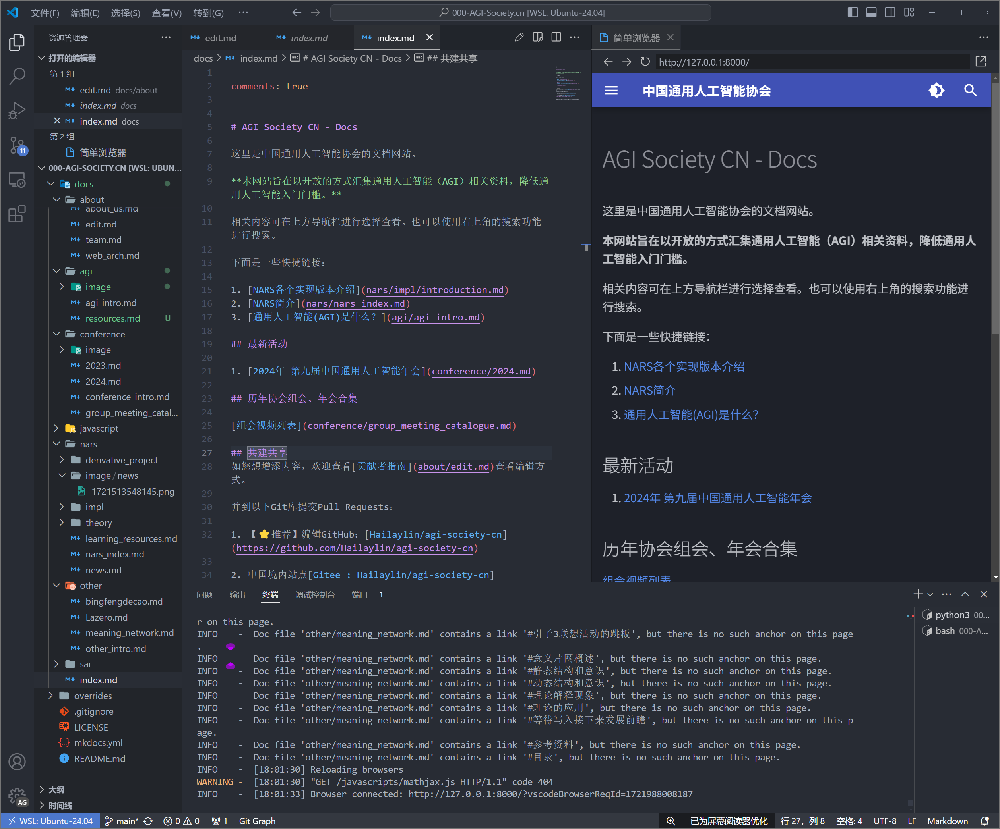
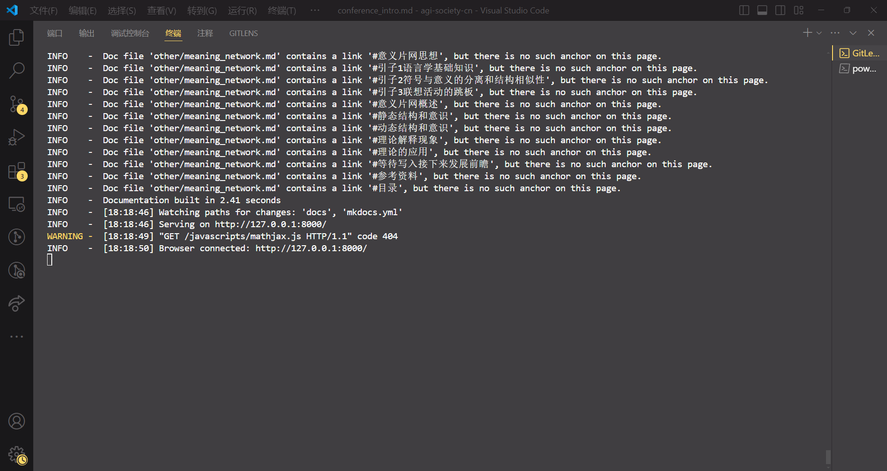
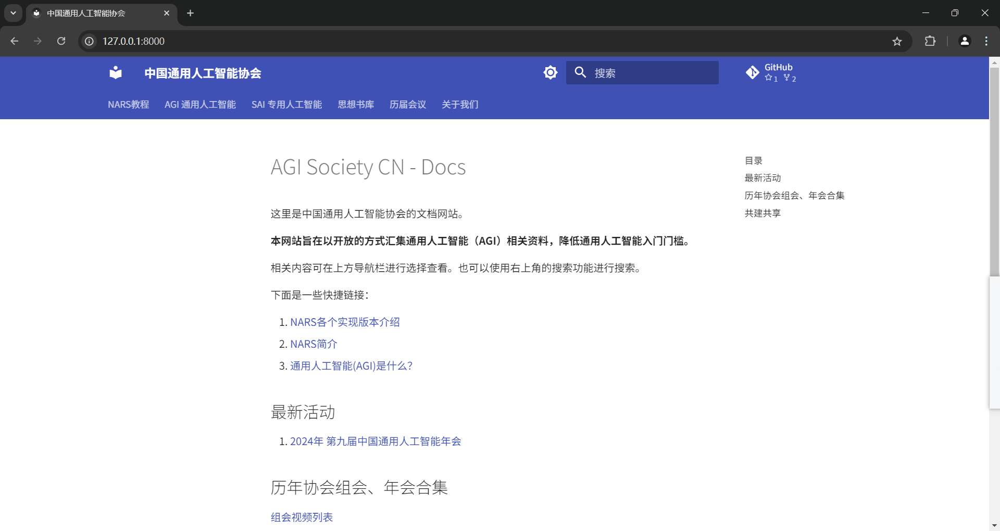

# 开发工具与环境配置

## 推荐编辑工具

1. [VSCode](https://code.visualstudio.com/)
2. [Obsidian](https://obsidian.md/)
3. [Typora](https://typora.io/)
4. etc.

（欢迎推荐更优秀的编辑工具）

## 配置实时开发环境

- [Linux](#linux)
- [Windows](#windows)

### Linux

以下配置在Windows11 + WSL2 Ubuntu 24.02上经过测试。

#### 0. `git clone`

移动到你要clone的目录后：

````bash
git clone https://github.com/Hailaylin/agi-society-cn.git
````

> 推荐clone的目录在WSL2的虚拟机内部路径，这样磁盘IO会很快。而跨文件系统（linux <->  Windows）的操作会很慢。

#### 1. 安装 Python 虚拟环境

如果报错，则需要先安装python3，然后再执行上面的命令。apt源推荐换成清华源。

````bash
sudo apt install python3-full
````

并且在主机创建虚拟环境

````bash
python3 -m venv agi-society-pyenv
````

进入虚拟环境

````bash
source agi-society-pyenv/bin/activate
````

然后你的终端会显示：

````bash
(agi-society-pyenv) starlin@StarCloud:/mnt/d/NARS/000-AGI-Society.cn$
````

则你已经入虚拟环境中。

#### 2. 启动实时预览

安装 mkdocs-material。网络不畅则需要设置pip国内镜像源。

````bash
pip install mkdocs-material
````

启动服务

````bash
mkdocs serve
````

#### 3. VSCode 实时预览

效果如下：


### Windows

以下配置在Windows11 + Python 3.11.4中测试通过。

步骤0同[Linux](#0-git-clone)。

#### 1. 安装Python

可在[官网下载](https://www.python.org/downloads/windows/)并安装Python，推荐选择尽量新的稳定版。

下载好安装程序后，根据安装程序指引安装即可。

#### 2. 安装扩展

若Python环境已搭建完毕，此时可以使用[pip](https://pypi.org/)安装[MKDocs](https://www.mkdocs.org/)包`mkdocs-material`：

````bash
pip install mkdocs-material
````

/// tip | 虚拟环境分隔运行

若不希望在系统全局安装 `mkdocs-material` 包，可以创建一个虚拟环境，在虚拟环境中安装 `mkdocs-material`。

具体可参考[Linux对应小节](#1-安装-python-虚拟环境)，或网络搜索关键词

```plaintext
Python venv 创建虚拟环境
```

///

#### 3. 开启实时预览

同[Linux对应小节](#2-启动实时预览)，在Git仓库目录下（如`...\agi-society-cn\`）运行如下命令：

```bash
mkdocs serve
```

此时若观察到如下输出：

```bash
INFO    -  [**:**:**] Browser connected: http://127.0.0.1:8000/[...]
```

则说明启动成功。

此时打开浏览器，访问其中的链接`http://127.0.0.1:8000/[...]`即可看到实时预览。




