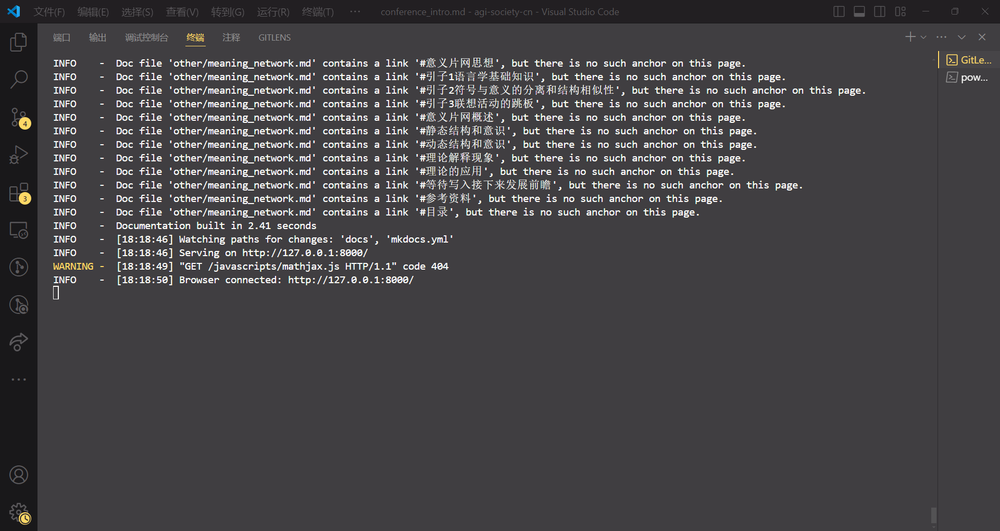
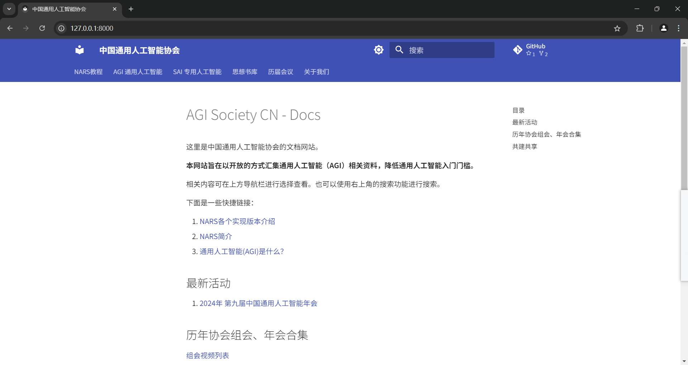

# 本网站编辑格式

[🔗Markdown标准（英文）](https://commonmark.org/)

[🔗PyMDown官网文档](https://facelessuser.github.io/pymdown-extensions)

- ℹ️特别建议查看其中与标准Markdown不同的[块(block)语法](https://facelessuser.github.io/pymdown-extensions/extensions/blocks/)

## 文件规范

//// warning | 文件名规范

***所有Markdown文件，不论是否专名（如"NARS"），文件名一律使用snake_case蛇形命名规范***

- ⚠️实际网站运行中**区分大小写**，所以请务必确保文件名符合规范

在Git提交上，若需更改，编辑时请在 `.git/config` 中将 `core.ignorecase` 设置为 **`false`**

代码：

```bash
git config --global core.ignorecase false
```

/// example | 专名亦要全小写

❌ `NARS.md`

✅ `nars.md`

///

/// example | 首字母亦要小写

❌ `Lazero.md`

✅ `lazero.md`

///

/// example | 下划线`_`而非短斜杠`-`

❌ `web-arch.md`

✅ `web_arch.md`

///

/// example | 下划线分隔而非驼峰分隔

❌ `WebArch.md` `webArch.md`

✅ `web_arch.md`

///

////

（2024-07-27 其它有待扩充）

## 模块化内容渲染

使用PyMdown及其Extension：

/// note | 如何使用 block

````markdown
/// note | name

some context

///
````

note 字段可以是以下types里面的任意一种

````yaml
  - pymdownx.blocks.admonition:
      types:
      - new
      - settings
      - note
      - abstract
      - info
      - tip
      - success
      - question
      - warning
      - failure
      - danger
      - bug
      - example
      - quote
````

如：

````markdown
/// example | 例如

就像这样

///
````

此将生成：

/// example | 例如

就像这样

///

///

/// details | 或者是这样的可折叠块

hi hi hi ，我被二向箔折叠啦

/// details | 折叠块还能改变类型
    type: warning

我竟然被二向箔打了两遍

///

/// details | 折叠块还能强制不折叠
    open: true
    type: example

这不是套娃吗？

///

///

## 推荐编辑工具

1. [VSCode](https://code.visualstudio.com/)
2. [Obsidian](https://obsidian.md/)
3. [Typora](https://typora.io/)
4. etc.

（欢迎推荐更优秀的编辑工具）

## 配置实时开发环境

- [Linux](#linux)
- [Windows](#windows)

### Linux

以下配置在Windows11 + WSL2 Ubuntu 24.02上经过测试。

#### 0. `git clone`

移动到你要clone的目录后：

````bash
git clone https://github.com/Hailaylin/agi-society-cn.git
````

> 推荐clone的目录在WSL2的虚拟机内部路径，这样磁盘IO会很快。而跨文件系统（linux <->  Windows）的操作会很慢。

#### 1. 安装 Python 虚拟环境

如果报错，则需要先安装python3，然后再执行上面的命令。apt源推荐换成清华源。

````bash
sudo apt install python3-full
````

并且在主机创建虚拟环境

````bash
python3 -m venv agi-society-pyenv
````

进入虚拟环境

````bash
source agi-society-pyenv/bin/activate
````

然后你的终端会显示：

````bash
(agi-society-pyenv) starlin@StarCloud:/mnt/d/NARS/000-AGI-Society.cn$
````

则你已经入虚拟环境中。

#### 2. 启动实时预览

安装 mkdocs-material。网络不畅则需要设置pip国内镜像源。

````bash
pip install mkdocs-material
````

启动服务

````bash
mkdocs serve
````

#### 3. VSCode 实时预览

效果如下：


### Windows

以下配置在Windows11 + Python 3.11.4中测试通过。

步骤0同[Linux](#0-git-clone)。

#### 1. 安装Python

可在[官网下载](https://www.python.org/downloads/windows/)并安装Python，推荐选择尽量新的稳定版。

下载好安装程序后，根据安装程序指引安装即可。

#### 2. 安装扩展

若Python环境已搭建完毕，此时可以使用[pip](https://pypi.org/)安装[MKDocs](https://www.mkdocs.org/)包`mkdocs-material`：

````bash
pip install mkdocs-material
````

/// tip | 虚拟环境分隔运行

若不希望在系统全局安装 `mkdocs-material` 包，可以创建一个虚拟环境，在虚拟环境中安装 `mkdocs-material`。

具体可参考[Linux对应小节](#1-安装-python-虚拟环境)，或网络搜索关键词

```plaintext
Python venv 创建虚拟环境
```

///

#### 3. 开启实时预览

同[Linux对应小节](#2-启动实时预览)，在Git仓库目录下（如`...\agi-society-cn\`）运行如下命令：

```bash
mkdocs serve
```

此时若观察到如下输出：

```bash
INFO    -  [**:**:**] Browser connected: http://127.0.0.1:8000/[...]
```

则说明启动成功。

此时打开浏览器，访问其中的链接`http://127.0.0.1:8000/[...]`即可看到实时预览。




