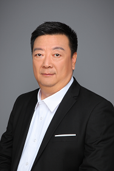

# 研究团队介绍

## 王培

> 美国天普大学计算机系教授，博士生导师。博士师从侯世达（Douglas Hofstadter）。

[学术主页↗](https://cis.temple.edu/~pwang/)
[个人CV↗](https://cis.temple.edu/~pwang/PeiWangCV.html "Curriculum Vitae of Pei Wang (temple.edu)")
[知网↗](https://chn.oversea.cnki.net/kcms/detail/knetsearch.aspx?sfield=au&skey=%E7%8E%8B%E5%9F%B9&code=000030813766&v=S9YHj3BEsKa5fwwTFPnTmqScyLd2I_AasnZGijQCwpKf4UHLVXsBbaUm89ugcmww)
[email↗](mailto:pei.wang@temple.edu)

主要研究:

- 通用人工智能
- 非公理推理
- 逻辑与推理
- 不确定性
- 意义与真值
- 概念与学习
- 动态资源管理

王培教授是

1. OpenNARS项目（通用人工智能项目）的发起人和主要编写者，
2. [国际AGI协会](http://agi-conf.org/)的发起人和常驻委员
3. 《哥德尔、埃舍尔、巴赫——集异璧之大成》的译者之一

同时也是

1. 中国NARS小组的指导老师
2. 中国通用人工智能协会的常驻点评指导老师

关于王培教授的头衔和周边，实在太多，建议点击下面的链接，观看视频，阅读论文和项目源码，了解详情：

- [中文资料](https://cis.temple.edu/~pwang/Chinese.html)
- [OpenNARS Wiki](https://github.com/opennars/opennars/wiki)
- [读书人《通用人工智能》讲座视频](http://www.dushuren123.com/dushuren/video/share.html?id=1679351024)
- [国际AGI协会官网](http://agi-conf.org/)

### 个人访谈

[Pei Wang Interviews (temple.edu)](https://cis.temple.edu/~wangp/interviews.html)

里面有一些关于个人问题的回答等。与AGI强相关。

## 刘凯

> 博士，渤海大学，教育科学学院，教育技术学学硕及心理健康教育专硕硕士生导师，中国通用人工智能协会（筹）召集人

[知乎↗](https://www.zhihu.com/people/wuyuezhidian)
[Bilibili↗](https://space.bilibili.com/475410405)
[优酷↗](https://www.youku.com/profile/index/?uid=UMjE3MDM1OTcy)
[知网↗](https://chn.oversea.cnki.net/kcms/detail/knetsearch.aspx?sfield=au&skey=刘凯&code=000047659669;000047659669&v=y7vj98LMVg_UHxhubKBjMQQpbklWyJGk5a_8PeXYFeCYzWi5m1uTEUjjoX1xjAIIOeb1sc-Ug9eznEYpNQXXLA==)

研究方向：

- 通用人工智能与教育大科学的理论与实践
- 类脑系统开发与机器教育
- 计算精神病学

研究层次：

1. 理论
    1. 一般智能理论
    2. 一般学习理论
    3. 一般教育理论（含职业教育）研究
2. 技术
    1. 基于理解的动态学科知识图谱构建（学科数学）
    2. 教学材料的自组织与自改进（教育技术学）
    3. 精神障碍心理学标记物的拓扑发现与定位（精神病学）
    4. 基于经验建构的机器婴儿主动视觉（计算机科学）
3. 工程
    1. 研发通用人工智能框架下的类脑系统（计算机科学）
4. 应用
    1. 基于认知建构的下一代ITS（教育技术学）
    2. 教育干预手段治疗精神障碍（精神病学）

## 徐英瑾

> 哲学博士，复旦大学哲学学院教授，博士生导师

<!--  -->
<!-- ↑【2024-07-28 12:14:39】注：太大张了 -->

[学术主页↗](https://philosophy.fudan.edu.cn/64/8f/c14253a222351/page.htm)
[百度百科↗](https://baike.baidu.com/item/%E5%BE%90%E8%8B%B1%E7%91%BE/1778275)
[Bilibili↗](https://space.bilibili.com/1030)
[知网↗](https://chn.oversea.cnki.net/kcms/detail/knetsearch.aspx?sfield=au&skey=%E5%BE%90%E8%8B%B1%E7%91%BE&code=000036949310&v=f5P6chuNTza-7Rk3TFVHPGmsJDI8Q8tRORf9XlH8k8njXtviqPM535RNdHPUPx1o)
[email↗](mailto:yjxu@fudan.edu.cn)

专长：

- 分析哲学史
- 心灵哲学
- 人工智能哲学
- 分析哲学与欧陆哲学比较研究

著作：

- 《人工智能哲学十五讲》
- 《心智、语言和机器——维特根斯坦哲学与人工智能哲学的对话》

现为复旦大学哲学学院教授、博士生导师、全国重大社科项目“基于信息技术哲学的当代认识论研究”首席专家。

曾在意大利与美国各自进修一年。

他在这五年中（以及稍早的一些时候）累计获得

- 两次上海市哲学社会科学优秀成果奖（一、二、三等奖各一次）
- 两次全国高等院校优秀人文社会科学成果奖（二等奖，2009年；二等奖，2015）。

在2009年他被上海市委宣传部下属的东方学社评为“上海十大社科新人”，这是当年上海哲学界唯一入选者。

同时，他至今依然是上海哲学界目前唯一的全国优秀博士论文的获得者（2006年获奖）。

- 获奖的论文《维特根斯坦哲学转型期中的“现象学”之谜》（2006年复旦大学出版社出版，28万字）是汉语哲学界第一部（至今也是唯一一部）专门讨论维特根斯坦从其早期立场转向晚期立场之转型过程的专著。

代表作《心智、语言和机器——维特根斯坦哲学与人工智能哲学的对话》（76万字，人民出版社2013年10月出版）是国内目前最全面深入的关于人工智能哲学的研究著作。

目前徐英瑾还任中国知识论专业委员会副秘书长，2018年担任“世界哲学大会”人工智能分会场主席。

（上述资料源自学术主页）

## 那孜古力·斯拉木(那迪)

> 博士，西北民族大学，中国民族信息技术研究院，计算机技术、人工智能、大数据方向的硕士研究生导师

[知网↗](https://chn.oversea.cnki.net/kcms2/author/detail?v=wRD08hUPYgwHqv6pqt1Lry077C8HmYeFUg_u_vKAKELr9EuNyzuelYm8aFEHWLCDlsaQ35mKa0ssz5y7seHPRwYweIqJYvLqGRxektNLWL-gjim3eRBvXXRWBg--mAzQraqInCBc1Zy03vfEnEBPhEIi3C0Kz5X0byKD64Kg2olxmlgOimKHfRjBS1efeJAW&uniplatform=NZKPT&language=CHS)

主要研究领域：

1. 智能决策
2. 数据科学
3. 通用人工智能理论与技术

个人履历：

- 2005年毕业于新疆大学信息科学与工程学院并获计算机科学与技术专业工学学士学位
- 2008年毕业于新疆大学信息科学与工程学院并获计算机应用技术专业工学硕士学位
- 2016年毕业于天津大学计算机科学与技术学院并获计算机应用技术专业博士学位

中国计算机学会专业会员。

在SCI期刊、EI检索会议和国内核心期刊发表论多篇论文；

作为项目负责人获得新疆维吾尔自治区自然科学面向基金、国家博士后基金、西北民族大学人才引进项目启动基金等三项基金资助。

## 魏屹东

> 博士，山西大学教授，哲学方向博士生导师

[学术主页↗](https://cap.sxu.edu.cn/yjry/2358.htm)
[知网↗](https://chn.oversea.cnki.net/kcms2/author/detail?v=wRD08hUPYgym68S7GHd2poHMO-BDlA-GdxcWHe-R3H4JseLdQZ2VugdAtBPQIQnqVd2rPnJWpGXF8IQ_BKdhrwZnUrFnLUSwvC8RPbBMj0E_1-ZNNWcNYYVZ8VQ8TSPD&uniplatform=NZKPT&language=CHS)

主要研究领域：

- 适应性表征
- 自然科学理论与方法
- 哲学
- 心理学

## 李祥

> 博士，辽宁工业大学计算机讲师，人工智能方向硕士生导师。博士师从[王培](#_1)
<!-- * 📝【2024-08-30 20:13:46】MKDocs不支持中文标题索引，使用`_【标题序数】`引用小标题 -->

[学术主页↗](https://seie.lnut.edu.cn/info/14393/185134.htm)
[email↗](mailto:xiangliagi@lnut.edu.cn)
[联系电话↗](tel:+86-0416-4198700)

主要研究领域：

1. 通用人工智能
2. 认知科学
3. 人工智能情感

主讲：

- 本科生课程
    - 分布式数据库
    - 分布式大数据处理技术
    - 数据结构
    - 算法与程序设计
- 研究生课程
    - 人工智能
    - 机器学习

主持科研项目：

- 辽宁省教育厅面上项目：情感在实现自主化通用人工智能中的作用与机制
- 辽宁工业大学博士启动项目： 通用人工智能中自我意识以及情感的研究
