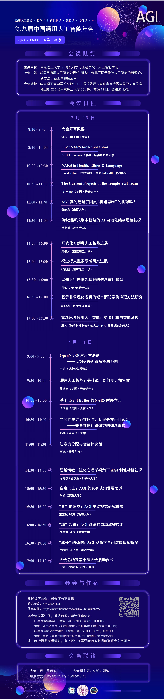

# 2024 中国通用人工智能年会

- 时间：2024年7月13日 ~ 2024年7月14日
- 地点：中国江苏南京，南京理工大学南京校区学术交流中心
- 主办单位：南京理工大学

## 年会海报

## 年会视频回顾

### （一）第一天上午议程

[Bilibili↗](https://www.bilibili.com/video/BV1p4421D78q)

1. [OpenNARS for Applications](https://www.bilibili.com/video/BV1p4421D78q/?p=1), Patrick Hammer, 斯德哥尔摩大学
2. [NARS in Health, Ethics & Language](https://www.bilibili.com/video/BV1p4421D78q/?p=2), David Ireland, 健康研究中心
3. [The Current Projects of the Temple AGI Team](https://www.bilibili.com/video/BV1p4421D78q/?p=3), 王培, 天普大学
4. [AGI真的超越了图灵“机器思维”的构想吗](https://www.bilibili.com/video/BV1p4421D78q/?p=4), 魏屹东, 山西大学
5. [俄狄浦斯式剧本框架的AI自动化编制思路初探](https://www.bilibili.com/video/BV1p4421D78q/?p=5), 徐英瑾, 复旦大学

### （二）第一天下午议程

[Bilibili↗](https://www.bilibili.com/video/BV1zE421A7rr)

1. [形式化可解释人工智能进展](https://www.bilibili.com/video/BV1zE421A7rr/?p=1), 周倩如, 南京理工大学
2. [视觉行人搜索领域研究进展](https://www.bilibili.com/video/BV1zE421A7rr/p=2), 张姗姗, 南京理工大学
3. [以知识生态学为基础的信念演化模型](https://www.bilibili.com/video/BV1zE421A7rr/p=3), 那迪, 西北民族大学
4. [基于非公理化逻辑的城市消防案例推理方法研究](https://www.bilibili.com/video/BV1zE421A7rr/p=4), 杨明鑫, 西北民族大学
5. [重新思考通用人工智能：类脑计算与智能涌现](https://www.bilibili.com/video/BV1zE421A7rr/p=5), 周芃(péng), 陆兮科技

### （三）第二天上午议程

[Bilibili↗](https://www.bilibili.com/video/BV1Ff421B7sp)

1. [OpenNARS应用方法论——以钢材表面缝隙检测为例](https://www.bilibili.com/video/BV1Ff421B7sp/?p=1), 王涛, 湖北经济学院
2. [通用人工智能：是什么、如何测、如何做](https://www.bilibili.com/video/BV1Ff421B7sp/?p=2), 徐博文, 天普大学
3. [基于Event Buffer的NARS时序学习](https://www.bilibili.com/video/BV1Ff421B7sp/?p=3), 李汤睿, 天普大学
4. [当我们在讨论情感时，到底是在讲什么](https://www.bilibili.com/video/BV1Ff421B7sp/?p=4), 孙强, 西安理工大学
5. [注意力分配与智能体决策](https://www.bilibili.com/video/BV1Ff421B7sp/?p=5), 黄彧, 陆兮科技

### （四）第二天下午议程

[Bilibili↗](https://www.bilibili.com/video/BV1dx4y1x7Vn)

1. [超越情欲：进化心理学视角下AGI利他动机初探](https://www.bilibili.com/video/BV1dx4y1x7Vn/?p=1), 冯博杰, 都柏林大学
2. [自底向上：AGI的具身认知发展之道](https://www.bilibili.com/video/BV1dx4y1x7Vn/?p=2), 刘凯, 渤海大学
3. 【⚠️线上不直播】“看”的感觉：AGI主动视觉研究进展, 王泰然、张涛, 渤海大学
4. 【⚠️线上不直播】“动”起来：AGI系统的自动驾驶技术, 林嘉濠、江成, 渤海大学
5. 【⚠️线上不直播】“成长”的烦恼：AGI视角下自闭症病理学新探, 卢桥桥、连小雨, 渤海大学
