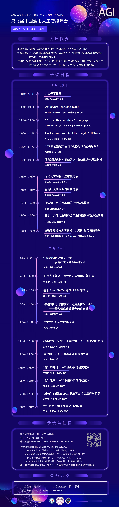

本次年会在南京理工大学举行。

## 年会视频回顾。

### [【2024年第九届中国通用人工智能年会（一）】 ](https://www.bilibili.com/video/BV1p4421D78q/?share_source=copy_web&vd_source=69a514dc0e2aaf825077e413b7f6a4d4)

第一天上午议程：
[1] OpenNARS for Applications，Patrick Hammer，斯德哥尔摩大学
[2] NARS in Health, Ethics & Language，David lreland，健康研究中心
[3] The Current Projects of the Temple AGI Team，王培，天普大学
[4] AGI真的超越了图灵“机器思维”的构想吗，魏屹东，山西大学
[5] 俄狄浦斯式剧本框架的AI自动化编制思路初探，徐英瑾，复旦大学

### [【2024年第九届中国通用人工智能年会（二）】 ](https://www.bilibili.com/video/BV1zE421A7rr/?share_source=copy_web&vd_source=69a514dc0e2aaf825077e413b7f6a4d4)

第一天下午议程：
[1]形式化可解释人工智能进展，周倩如，南京理工大学
[2]视觉行人搜索领域研究进展，张姗姗，南京理工大学
[3]以知识生态学为基础的信念演化模型，那迪，西北民族大学
[4]基于非公理化逻辑的城市消防案例推理方法研究，杨明鑫，西北民族大学
[5]重新思考通用人工智能：类脑计算与智能涌现，周芃，陆兮科技

### [【2024年第九届中国通用人工智能年会（三）】 ](https://www.bilibili.com/video/BV1Ff421B7sp/?share_source=copy_web&vd_source=69a514dc0e2aaf825077e413b7f6a4d4)

第二天上午议程：
[1]OpenNARS应用方法论——以钢材表面缝隙检测为例，王涛，湖北经济学院
[2]通用人工智能：是什么、如何测、如何做，徐博文，天普大学
[3]基于Event Buffer的NARS时序学习，李汤睿，天普大学
[4]当我们在讨论情感时，到底是在讲什么，孙强，西安理工大学
[5]注意力分配与智能体决策，黄彧，陆兮科技

### [【2024年第九届中国通用人工智能年会（四）】 ](https://www.bilibili.com/video/BV1dx4y1x7Vn/?p=4&share_source=copy_web&vd_source=69a514dc0e2aaf825077e413b7f6a4d4)

第二天下午议程：
[1]超越情欲：进化心理学视角下AGI利他动机初探，冯博杰，都柏林大学
[2]自底向上：AGI的具身认知发展之道，刘凯，渤海大学
[3]“看”的感觉：AGI主动视觉研究进展，王泰然、张涛，渤海大学
[4]“动”起来：AGI系统的自动驾驶技术，林嘉濠、江成，渤海大学
[5]“成长”的烦恼：AGI视角下自闭症病理学新探，卢桥桥、连小雨，渤海大学

## 年会海报

