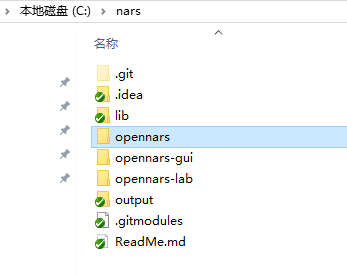
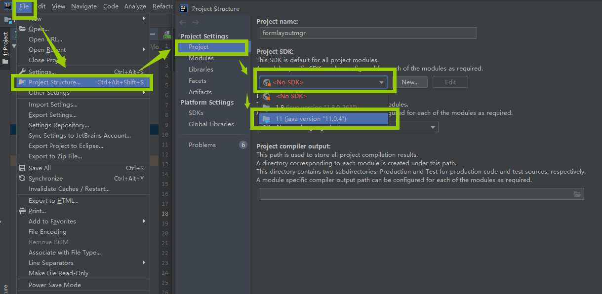
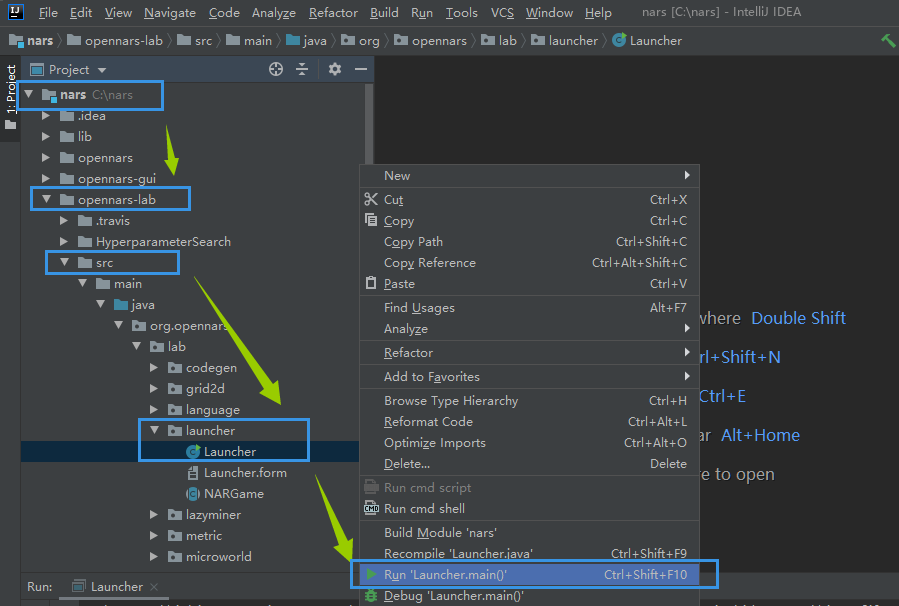
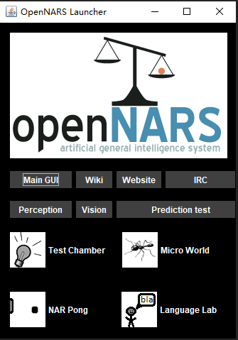
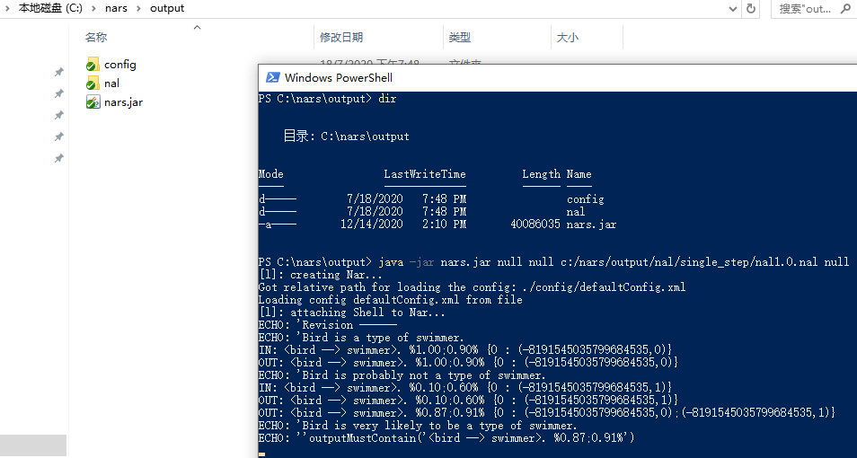

# OpenNARS

[官网↗](http://www.opennars.org/)

- 作者：*The OpenNARS team*

todo

## 各个版本

### OpenNARS 1.x

🕒最后更新时间：2024-07-26

- 当前最高版本：1.5.8
- 代码仓库参考：
  - [OpenNARS声明性内核](https://github.com/patham9/opennars_declarative_core)：由 *Patrick Hammer* 发布，适合以此实现自己的NAL 7~9层（时间推理、目标推理）
  - [ARCJ137442/OpenNARS-158-dev](https://github.com/ARCJ137442/OpenNARS-158-dev)：基于上述声明性内核的中文注释版，相比原版增加了许多内容注解，并优化了代码可读性

todo

### OpenNARS 3.x

- 当前最高版本：3.1.2
- 代码仓库参考：[opennars/opennars](https://github.com/opennars/opennars)

/// warning | 3.0.x & 3.1.0 与 3.1.x 的区别

todo

///

## 快速入门（迁移自官网）

🕒【2024-07-27 20:42:49】迁移自官网，[源链接↗](http://www.agi-society.cn/index.html?key=F5xSWA4ZKR2JyCWQG5BbFj5iNbXFkMem&blog=N4CZfCnE85ETFwE5RexB3KKehbpzsWje)

不同的 NARS 版本，打开方式稍有不同，下面以最新版（2020年12月16日）为例。由于网络问题，有些同学不能获取完整的 NARS 源码以及依赖库，所以我们把 NARS 打包到了百度网盘，方便大家下载：

<https://pan.baidu.com/s/1S0_4TrfHbrHtWgCRoI-vEQ>

提取码： **nars**

输入提取码下载后，请解压到 C盘 `nars` 目录，内部结构如下图，请对照目录结构，否则配置可能失效，特别是您不熟悉 java 相关配置的情况下。



如果之前没有安装过 Java SDK，则需安装 [Java SDK](https://www.oracle.com/java/technologies/downloads/#java11) ，另外，需要安装[IDEA 社区版](https://www.jetbrains.com/idea/download/download-thanks.html?platform=windows&code=IIC)  ，然后设置项目 SDK：


使用 IDEA ，打开 `C:/nars` 目录，并按下图次序展开，右键运行 NARS：


当屏幕呈现如下界面时，表示您已经成功开启了NARS：


到此处，本教程已经完成。如果有额外需求，比如希望在命令行下运行NARS ，请参考如下步骤：

在命令窗口中，去到 `C:/nars/output` 目录，

运行命令（注意`null`和空格）：

```bash
java -jar nars.jar null null C:/nars/output/nal/single_step/nal1.0.nal null
```



以上参数中， `C:/nars/output/nal/single_step/nal1.0.nal`  代表 NARS 启动后需要测试的内容。
