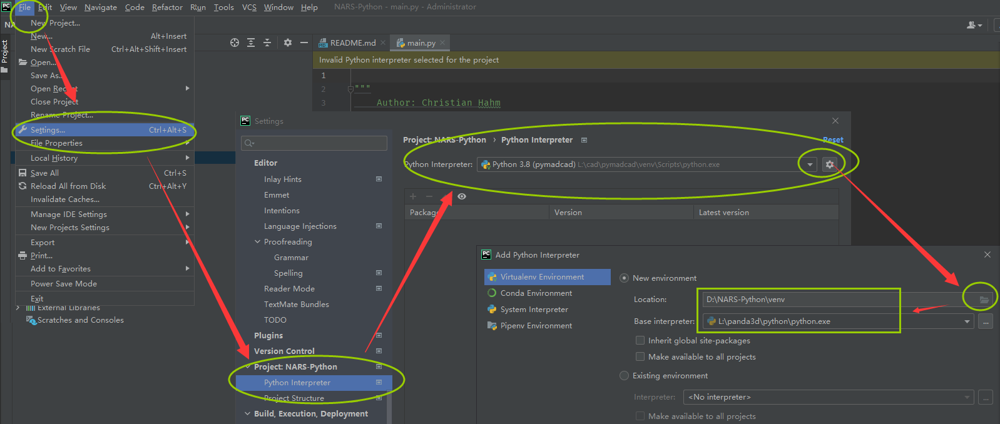

# NARS-Python

[GitHub↗](https://github.com/ccrock4t/NARS-Python)

- 作者：*Christian Hahm*
    - [GitHub↗](https://github.com/ccrock4t)

todo

## 快速入门（迁移自官网）

🕒【2024-07-27 20:43:24】迁移自官网，[源链接↗](http://www.agi-society.cn/index.html?key=F5xSWA4ZKR2JyCWQG5BbFj5iNbXFkMem&blog=AnHb3CMnkckJh5GeeMS5N3ijGsGQbZCE)

先安装 Python （这里建议使用迅雷下载，因为 Python 官网比较慢）：
<https://www.python.org/ftp/python/3.9.5/python-3.9.5-amd64.exe>

接下来安装 Python 集成开发环境：

一直到最近几年，依然有很多编辑器无法方便快捷的对代码进行定义跳转和重构，所以选一款好的编辑器是比较重要的事情，能极大的提高工作学习的效率。

这里推荐一款 Python IDE 集成开发环境： PyCharm

下载地址：<https://www.jetbrains.com/pycharm/download/>

安装好后，去如下链接下载 NARS Python 版：

<https://gitee.com/opennars/NARS-Python>

或 <https://github.com/ccrock4t/NARS-Python>

前一个是国内镜像，后一个是原版最新地址，如果你能科学上网，推荐后一个链接。

解压到D盘，结构如下：

双击桌面的 PyCharm 图标，然后打开解压后的目录：

（下面这个步骤**不是必要的**）除非编辑器找不到 python.exe 或你想换一个 python.exe 版本：

接下来试着右键点击并启动 main.py （应该会报错，因为缺少某些库）：

