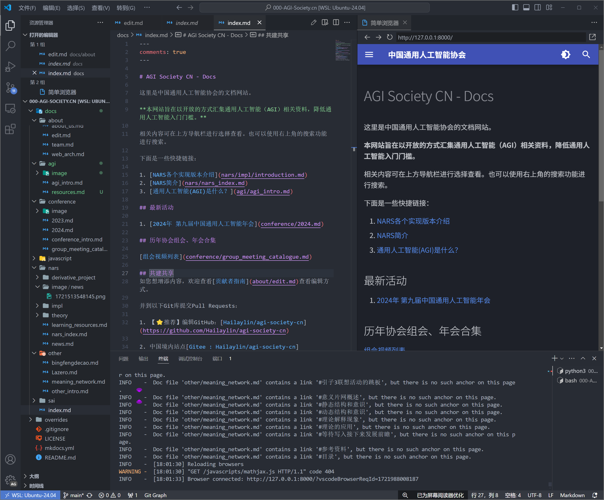
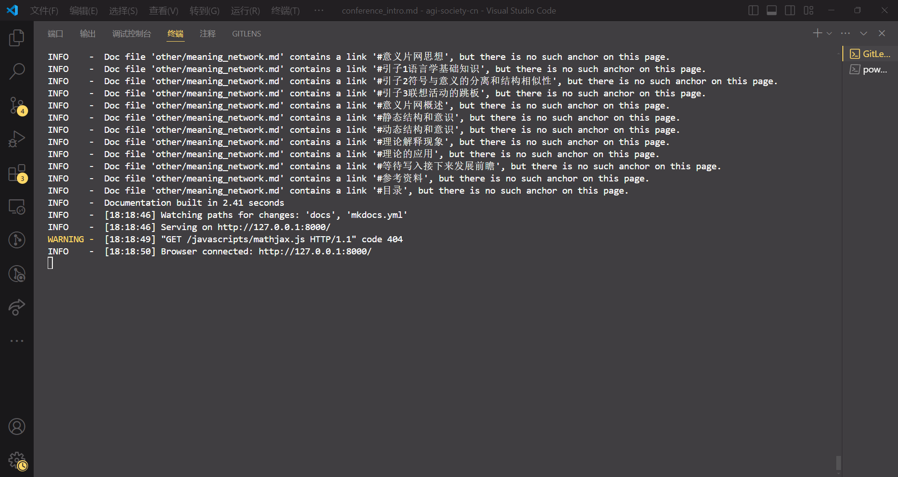
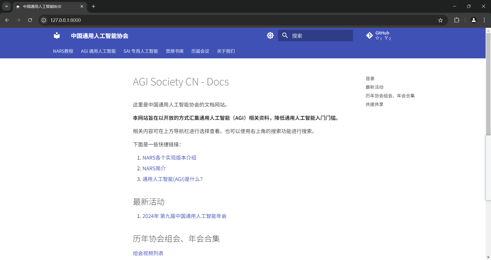

# 开发工具与环境配置

## 推荐编辑工具

1. [VSCode](https://code.visualstudio.com/)
2. [Obsidian](https://obsidian.md/)
3. [Typora](https://typora.io/)
4. etc.

（欢迎推荐更优秀的编辑工具）

## 配置实时开发环境

- [Linux](#linux)
- [Windows](#windows)

### Linux

以下配置在 Windows 11 + WSL2 Ubuntu 24.04 上经过测试。

#### 0. 安装 Node.js

本 Wiki 基于 [VitePress](https://vitepress.dev/) 构建，需要 Node.js 运行环境。推荐使用 [nvm](https://github.com/nvm-sh/nvm) 管理 Node.js 版本：

```bash
curl -o- https://raw.githubusercontent.com/nvm-sh/nvm/v0.40.1/install.sh | bash
```

安装后重开终端，然后安装 Node.js（要求版本 ≥ 18）：

```bash
nvm install 20
nvm use 20
```

> [!tip] 使用系统包管理器
>
> 也可以直接通过 apt 安装：
>
> ```bash
> sudo apt install nodejs npm
> ```
>
> 但 apt 源中的 Node.js 版本可能较旧，建议优先使用 nvm。

#### 1. `git clone`

移动到你要 clone 的目录后：

```bash
git clone https://github.com/Hailaylin/agi-society-cn.git
cd agi-society-cn
```

> [!tip] 磁盘 IO 性能
>
> 推荐 clone 到 WSL2 的虚拟机内部路径，这样磁盘 IO 会很快。跨文件系统（Linux ↔ Windows）的操作会很慢。

#### 2. 安装项目依赖

进入 `wiki/` 子目录，安装 npm 依赖：

```bash
cd wiki
npm install
```

> [!tip] 网络不畅时设置 npm 镜像源
>
> ```bash
> npm config set registry https://registry.npmmirror.com
> ```

#### 3. 启动实时预览

```bash
npm run dev
```

此命令等效于 `vitepress dev`。此时若观察到如下输出：

```plaintext
  vitepress v1.6.3

  ➜  Local:   http://localhost:5173/
  ➜  Network: use --host to expose
```

则说明启动成功。在浏览器中打开 `http://localhost:5173/` 即可实时预览。

> [!note] VitePress 热更新
>
> VitePress 基于 Vite 构建，支持 HMR（热模块替换）。编辑 Markdown 文件后保存，浏览器会自动刷新显示最新内容，无需手动刷新。

#### 4. VSCode 实时预览

效果如下：



> [!warning] 截图待更新
>
> 此截图基于旧版 MkDocs 环境。VitePress 界面与此不同，但基本工作流一致：左侧 VSCode 编辑 Markdown，右侧浏览器实时预览。

### Windows

以下配置在 Windows 11 + Node.js 20 中测试通过。

步骤 1 同 [Linux](#1-git-clone)。

#### 1. 安装 Node.js

可在 [Node.js 官网](https://nodejs.org/) 下载并安装 LTS 版本（要求 ≥ 18），推荐选择最新的长期支持版。

下载好安装程序后，根据安装程序指引安装即可。安装完成后在终端验证：

```bash
node --version
npm --version
```

#### 2. 安装项目依赖

同 [Linux 对应小节](#2-安装项目依赖)，在 `wiki/` 目录下运行：

```bash
npm install
```

#### 3. 开启实时预览

同 [Linux 对应小节](#3-启动实时预览)，在 `wiki/` 目录下运行：

```bash
npm run dev
```

此时若观察到如下输出：

```plaintext
  vitepress v1.6.3

  ➜  Local:   http://localhost:5173/
```

则说明启动成功。

> [!tip] 局域网预览
>
> 若需要在手机或其他设备上预览，可使用 `--host` 参数：
>
> ```bash
> npx vitepress dev --host
> ```
>
> 此时终端会额外输出一个局域网地址，如 `Network: http://192.168.1.x:5173/`。

此时打开浏览器，访问 `http://localhost:5173/` 即可看到实时预览。





> [!warning] 截图待更新
>
> 以上截图基于旧版 MkDocs 环境。VitePress 界面有所不同，待替换为新截图。

## 构建生产环境

本地开发完成后，可以在 `wiki/` 目录下运行构建命令生成静态网站：

```bash
npm run build
```

构建产物在 `wiki/dist/` 目录中，可直接部署到任意静态文件服务器。

若要在本地预览构建结果：

```bash
npm run serve
```

## 常见问题

> [!question] `npm install` 报错？
>
> 请检查 Node.js 版本是否 ≥ 18。可用 `node --version` 查看。

> [!question] `vitepress dev` 启动后页面 404？
>
> 请确保终端当前工作目录在 `wiki/` 下，而非项目根目录。

> [!question] 端口 5173 被占用？
>
> VitePress 会自动尝试下一个可用端口（5174、5175...）。观察终端输出的实际地址即可。
