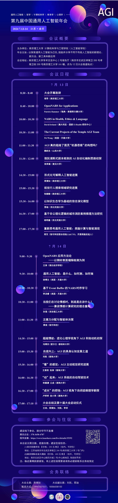

# 第九届中国通用人工智能年会

**时间地点**：2024年7月13-14日，南京理工大学

## 会议视频

| 场次 | B站链接 |
|------|---------|
| 第九届（一） | [BV1p4421D78q](https://www.bilibili.com/video/BV1p4421D78q) |
| 第九届（二） | [BV1zE421A7rr](https://www.bilibili.com/video/BV1zE421A7rr) |
| 第九届（三） | [BV1Ff421B7sp](https://www.bilibili.com/video/BV1Ff421B7sp) |
| 第九届（四） | [BV1dx4y1x7Vn](https://www.bilibili.com/video/BV1dx4y1x7Vn) |

## 会议内容

| # | 来源 | 报告人 | 报告标题 |
|---|------|--------|---------|
| 1 | [B站](https://www.bilibili.com/video/BV1p4421D78q?p=1) | Patrick Hammer | OpenNARS for Applications |
| 2 | [B站](https://www.bilibili.com/video/BV1p4421D78q?p=2) | David Ireland | NARS in Health, Ethics & Language |
| 3 | [B站](https://www.bilibili.com/video/BV1p4421D78q?p=3) | Pei Wang | The Current Projects of the Temple AGI Team |
| 4 | [B站](https://www.bilibili.com/video/BV1p4421D78q?p=4) | 魏屹东 | AGI真的超越了图灵"机器思维"的构想吗？ |
| 5 | [B站](https://www.bilibili.com/video/BV1p4421D78q?p=5) | 徐英瑾 | 俄狄浦斯式剧本框架的AI自动化编制思路初探 |
| 6 | [B站](https://www.bilibili.com/video/BV1zE421A7rr?p=1) | 周倩如 | 形式化可解释人工智能进展 |
| 7 | [B站](https://www.bilibili.com/video/BV1zE421A7rr?p=2) | 张姗姗 | 视觉行人搜索领域研究进展 |
| 8 | [B站](https://www.bilibili.com/video/BV1zE421A7rr?p=3) | 那迪 | 以知识生态学为基础的信念演化模型 |
| 9 | [B站](https://www.bilibili.com/video/BV1zE421A7rr?p=4) | 杨明鑫 | 基于非公理化逻辑的城市消防案例推理方法研究 |
| 10 | [B站](https://www.bilibili.com/video/BV1zE421A7rr?p=5) | 周芃 | 重新思考通用人工智能：类脑计算与智能涌现 |
| 11 | [B站](https://www.bilibili.com/video/BV1Ff421B7sp?p=1) | 王涛 | OpenNARS应用方法论——以钢材表面缝隙检测为例 |
| 12 | [B站](https://www.bilibili.com/video/BV1Ff421B7sp?p=2) | 徐博文 | 通用人工智能：是什么、如何测、如何做 |
| 13 | [B站](https://www.bilibili.com/video/BV1Ff421B7sp?p=3) | 李汤睿 | 基于Event Buffer的NARS时序学习 |
| 14 | [B站](https://www.bilibili.com/video/BV1Ff421B7sp?p=4) | 孙强 | 当我们在讨论情感时，到底是在讲什么？——兼谈情感计算研究的理念重构 |
| 15 | [B站](https://www.bilibili.com/video/BV1dx4y1x7Vn?p=1) | 冯博杰 | 超越情欲：进化心理学视角下AGI利他动机初探 |
| 16 | — | 黄英辉 | 基于NARS-GPT情感支持机器人效能评估与促进 |
| 17 | [B站](https://www.bilibili.com/video/BV1dx4y1x7Vn?p=2) | 刘凯 | 自底向上：AGI的具身认知发展之路 |
| 18 | [B站](https://www.bilibili.com/video/BV1dx4y1x7Vn?p=3) | 王泰然、张涛 | "看"的感觉：AGI主动视觉研究进展 |
| 19 | [B站](https://www.bilibili.com/video/BV1dx4y1x7Vn?p=5) | 卢桥桥、连小雨 | "成长"的烦恼：AGI视角下自闭症病理学新探 |
| 20 | [B站](https://www.bilibili.com/video/BV1dx4y1x7Vn?p=4) | 林嘉濠、江成 | "动"起来：AGI系统的自动驾驶技术 |

## 年会海报

