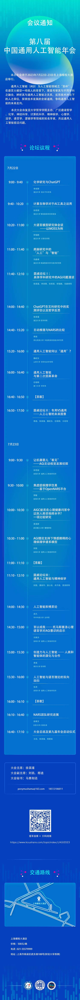

# 第八届中国通用人工智能年会

**时间地点**：2023年7月22-23日，复旦大学

## 会议视频

| 场次 | B站链接 |
|------|---------|
| 第八届（一） | [BV11M4y1p7mG](https://www.bilibili.com/video/BV11M4y1p7mG) |
| 第八届（二） | [BV1bc411w7BV](https://www.bilibili.com/video/BV1bc411w7BV) |
| 第八届（三） | [BV1rp4y157qy](https://www.bilibili.com/video/BV1rp4y157qy) |
| 第八届（四） | [BV16V4y1q7GL](https://www.bilibili.com/video/BV16V4y1q7GL) |

## 会议内容

| # | 来源 | 报告人 | 报告标题 |
|---|------|--------|---------|
| 1 | [B站](https://www.bilibili.com/video/BV11M4y1p7mG?p=2) | 李剑锋 | ChatGPT在化学研究中的应用与人工智能的未来 |
| 2 | [B站](https://www.bilibili.com/video/BV11M4y1p7mG?p=3) | 孙思琦 | 计算生物学对于AI工具之运用 |
| 3 | [B站](https://www.bilibili.com/video/BV11M4y1p7mG?p=4) | 邱锡鹏 | 大语言模型研究体会谈——以MOSS为例 |
| 4 | [B站](https://www.bilibili.com/video/BV11M4y1p7mG?p=5) | 冯建峰 | 类脑研究中的"人工"与"智能" |
| 5 | [B站](https://www.bilibili.com/video/BV11M4y1p7mG?p=6) | 主持人：徐英瑾 | 圆桌论坛Ⅰ：具体学科研究中的AGI问题漫谈 |
| 6 | [B站](https://www.bilibili.com/video/BV1bc411w7BV?p=1) | 徐英瑾 | 对于ChatGPT的自然语言处理能力的测评与哲学反思 |
| 7 | [B站](https://www.bilibili.com/video/BV1bc411w7BV?p=2) | 那迪 | 主动推理与NARS的比较 |
| 8 | [B站](https://www.bilibili.com/video/BV1bc411w7BV?p=3) | 魏屹东 | 通用人工智能何以"通用"？ |
| 9 | [B站](https://www.bilibili.com/video/BV1bc411w7BV?p=4) | 任晓明 | 通用人工智能与第二次因果革命 |
| 10 | [B站](https://www.bilibili.com/video/BV1bc411w7BV?p=5) | 主持人：那迪 | 圆桌论坛Ⅱ：专用VS通用——人工心智的未来图景 |
| 11 | [B站](https://www.bilibili.com/video/BV1rp4y157qy?p=1) | 孙常新、刘凯 | 让机器婴儿"看见"——AGI主动视觉发展初探 |
| 12 | [B站](https://www.bilibili.com/video/BV1rp4y157qy?p=2) | 贾敏、刘凯 | 焦虑症病理学仿真——基于OpenNARS平台 |
| 13 | [B站](https://www.bilibili.com/video/BV1rp4y157qy?p=3) | 黄英辉 | AIGC能否在心理健康问答中达到人类咨询师水平?一项比较研究 |
| 14 | [B站](https://www.bilibili.com/video/BV1rp4y157qy?p=4) | 刘凯 | AGI理论支持下情感障碍的心理病理学谱系模型 |
| 15 | [B站](https://www.bilibili.com/video/BV1rp4y157qy?p=5) | 主持人：刘凯 | 圆桌论坛Ⅲ：通用人工智能与精神病学 |
| 16 | [B站](https://www.bilibili.com/video/BV16V4y1q7GL?p=1) | 成凡 | 人工智能和博弈论 |
| 17 | [B站](https://www.bilibili.com/video/BV16V4y1q7GL?p=2) | 冯博杰 | 言以成我——托马斯塞洛心理语言学对AGI意识的启示 |
| 18 | [B站](https://www.bilibili.com/video/BV16V4y1q7GL?p=3) | 黄彧 | 创造力与人工智能——人类和智能体的演化与合作 |
| 19 | [B站](https://www.bilibili.com/video/BV16V4y1q7GL?p=4) | 张涛、刘凯 | 人工智能与语言理论的双向回归 |
| 20 | [B站](https://www.bilibili.com/video/BV16V4y1q7GL?p=5) | 徐博文 | NARS团队研究进展 |
| 21 | [B站](https://www.bilibili.com/video/BV16V4y1q7GL?p=6) | 王培、徐英瑾、周倩如 | 大会总结及第九届年会启动仪式 |

## 年会海报

